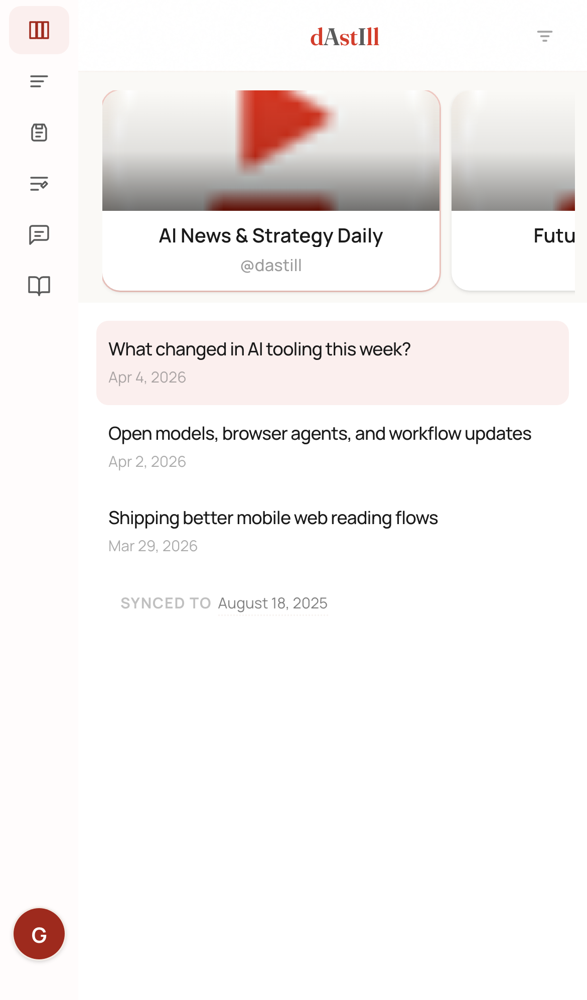
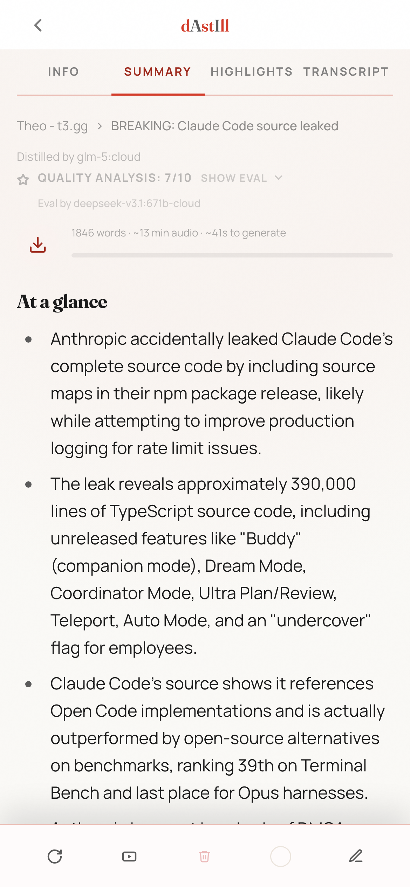
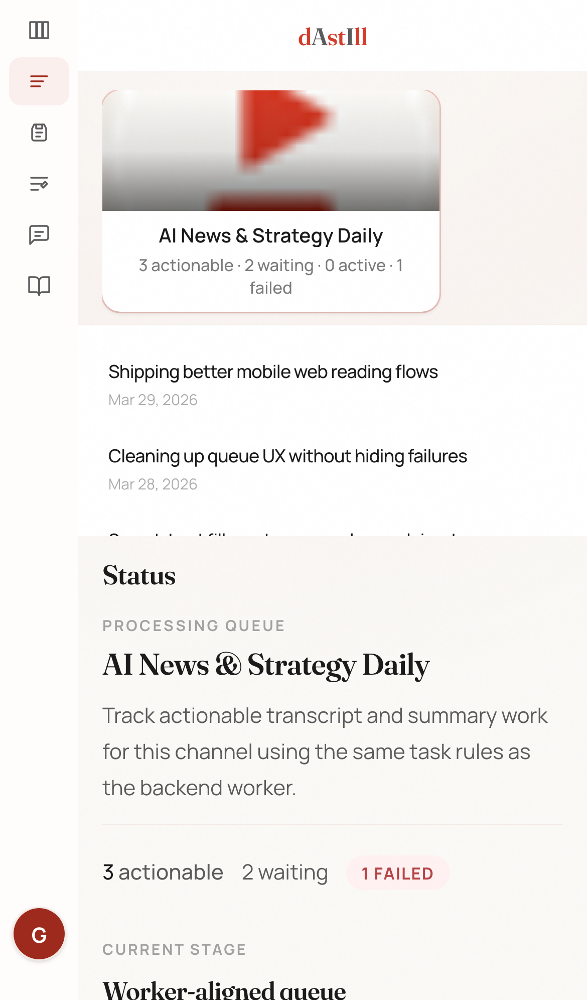
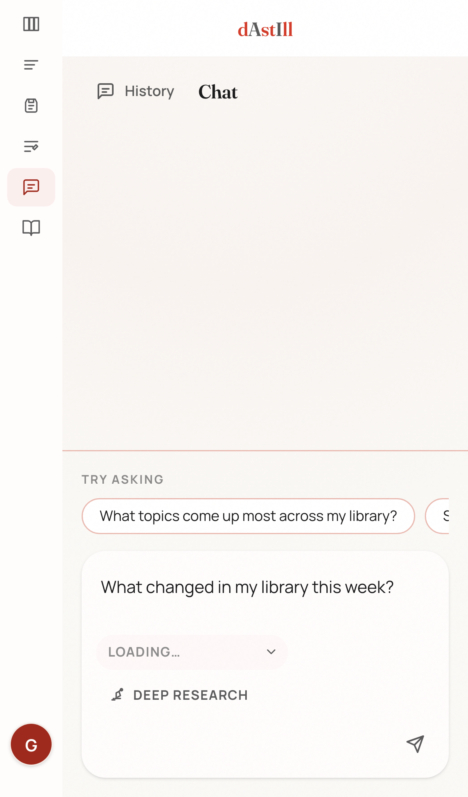

# UI Tour

_Updated April 10, 2026._

dAstIll works best as a short loop: browse followed sources, open a recent item, read the summary or transcript, then switch to queue or chat when you need more detail.

The screenshots below use the current phone-sized web layout. Desktop still exists, but this tour is intentionally mobile-led.

**Core routes:** Workspace, Queue, Highlights, Vocabulary, Chat, Docs.

## Surfaces

**Workspace** — Main view. Browse sources, scan synced items, and switch the selected item between info, summary, highlights, and transcript.

**Queue** — Processing status. See transcript extraction, summary generation, failures, and backfill depth without leaving the main layout.

**Channel overview** — Source-level view. Open a dedicated channel route to inspect one source, manage sync depth, and review that channel without the full reader layout.

**Chat** — Library chat. Ask questions across the same library, switch models per conversation, and turn on deep research for broader synthesis.

**Saved items** — Highlights and vocabulary. Save useful excerpts and define replacement rules for future summaries.

Anonymous browsing and quota-limited chat remain available before sign-in. The Guide button in the navigation rail reopens the built-in walkthrough from inside the workspace.

## Mobile Browse

The workspace opens in browse mode first. The compact rail keeps the main routes visible while the channel and recent-item list stay in the primary scroll area.

_Browse view. Scan followed sources, recent items, and sync context before opening a specific item._

- The navigation rail stays visible even on a phone-sized viewport.
- Browse stays focused on source selection and recent items instead of splitting attention with reading tools.
- Sync context stays visible so you can tell how far back the library reaches.

## Mobile Reading

Once you open an item, the layout shifts from browsing to reading. The tab strip keeps summary, transcript, highlights, and info in one place.

_Reading view on the summary tab. Content is primary; navigation stays lightweight around it._

- Summary is the fastest way to triage an item on mobile.
- Info, transcript, and highlights stay one tap away in the same content strip.
- Item-level actions stay near the top of the reading view.

## Queue

Queue shows which items are still waiting on transcript or summary work and keeps the current channel's processing state in view.

_Queue view. The main pane switches to processing status, waiting work, and failure context._

- Queue is scoped to the selected source.
- Processing counts are visible without leaving the page.

## Chat

Chat uses the same library, but the workflow changes from reading one item to asking across many.

_Chat view. Starter prompts, draft area, and deep-research controls stay visible without a separate settings step._

- Anonymous chat stays available, but with limited quota and temporary history.
- Deep research and model choice stay in the conversation flow.
- Chat is strongest as a follow-up after you have already browsed or read a few items.

## Desktop Note

Desktop uses the same routes and content states. The difference is density: desktop can show browsing and reading side by side, while mobile web keeps one primary task in focus.

## Additional Surfaces

- `Channel overview` at `/channels/[id]` — source-focused management for one channel without opening a video in the main reader.
- `Highlights` — saved excerpt library built from transcript or summary selections.
- `Vocabulary` — replacement rules applied during future summary generation.
- `Login` — supports guest browsing, standard web Google sign-in, and the Android system-browser auth handoff used by the Tauri shell.
- `Docs` — separate VitePress frontend linked from the product header.
- `Guide` — reopens the in-product walkthrough overlay from inside the workspace.

## Why This UI Shape Matters

The UI is built around content state, not just navigation. Transcript readiness, summary readiness, evaluation status, search coverage, and acknowledgement state all appear directly in the reading and queue flows. The backend sends the frontend enough state to keep those views current while the pipeline is still running.
