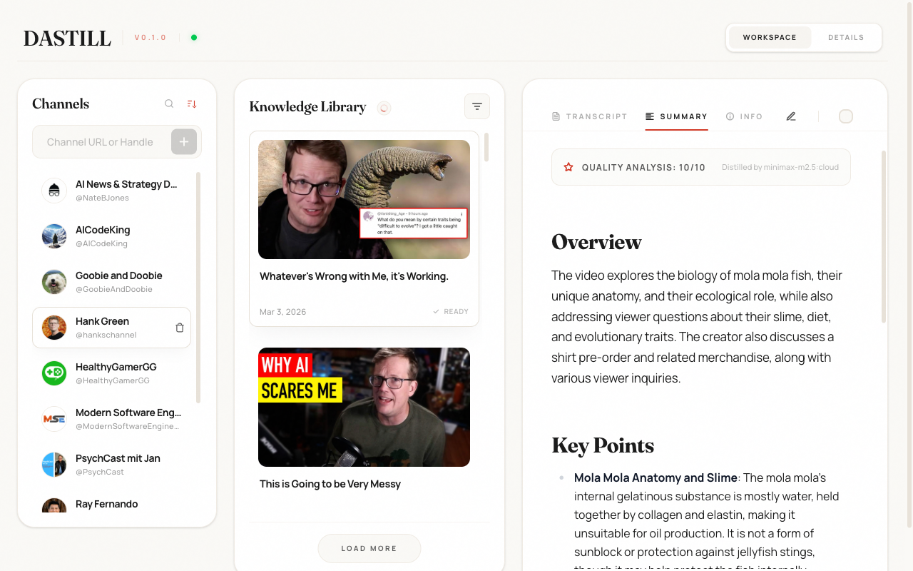
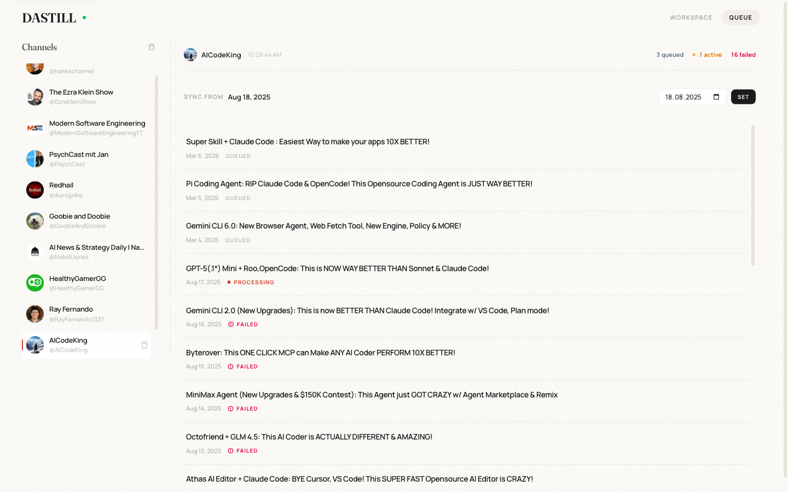
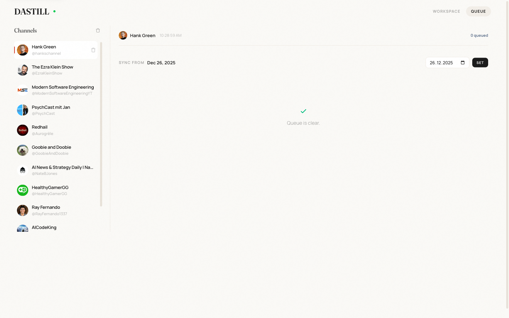
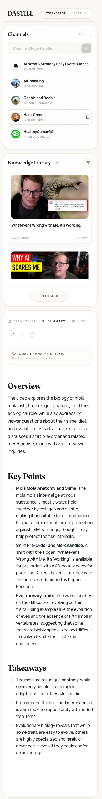
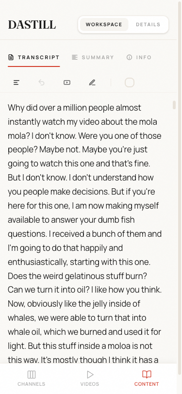
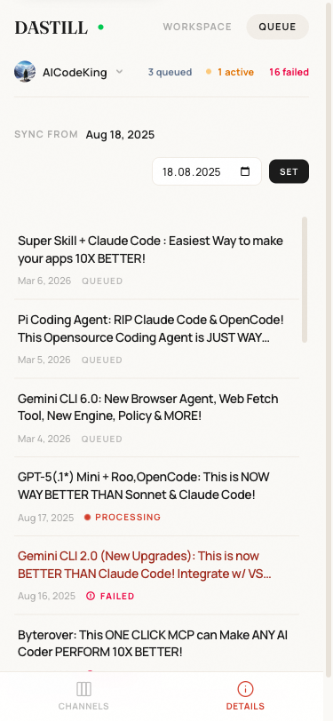

# UI Tour

## Product Surfaces

The current product UI is organized into route-level experiences centered on:

- main workspace (`/`)
- download queue (`/download-queue`)
- highlights (`/highlights`)
- chat (`/chat`)
- vocabulary (`/vocabulary`)
- channel overview (`/channels/[id]`)
- operator auth entrypoints (`/login`, `/logout`)

## Main Workspace

The workspace combines:

- channel management
- video browsing
- transcript and summary reading/editing
- search with result highlighting
- acknowledgement tracking

The shell is optimized for immediacy: subscribed channels render first, the selected channel snapshot loads right after, and content restores without waiting for the full workspace payload.

### Desktop workspace

## Queue Views

The queue surfaces operational backlog and incomplete content states.

### Queue with outstanding items

### Queue verification state

## Chat

The chat route enables RAG conversations with your video content:

- create and manage multiple conversations
- ask questions about transcripts and summaries
- receive AI responses grounded in retrieved source chunks
- view source attribution for each response

Anonymous visitors can use chat with limits in place, while operator sign-in unlocks admin-only actions such as destructive management.

Chat uses the semantic search index to find relevant content before generating responses.

## Mobile Layouts

The mobile screenshots in this repo document how the workspace adapts across:

- channels
- videos
- content view
- queue details

### Mobile full workspace

### Mobile content view

### Mobile queue details

## Why the UI Matters Architecturally

The product UI is not a thin shell over CRUD. It reflects multiple backend lifecycle states:

- transcript readiness
- summary readiness
- quality evaluation availability
- search indexing coverage
- acknowledgement state

That is why the backend exposes rich snapshot payloads and a combined bootstrap endpoint, even though the main frontend loads channels first and defers the selected-channel snapshot until after the sidebar is on screen.
