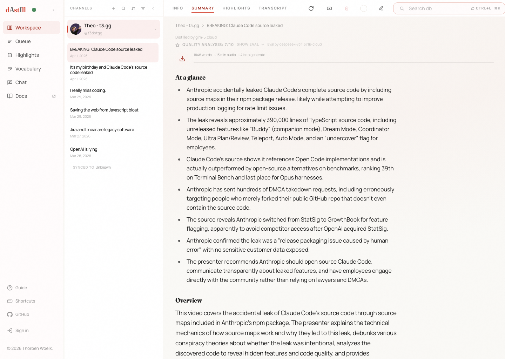
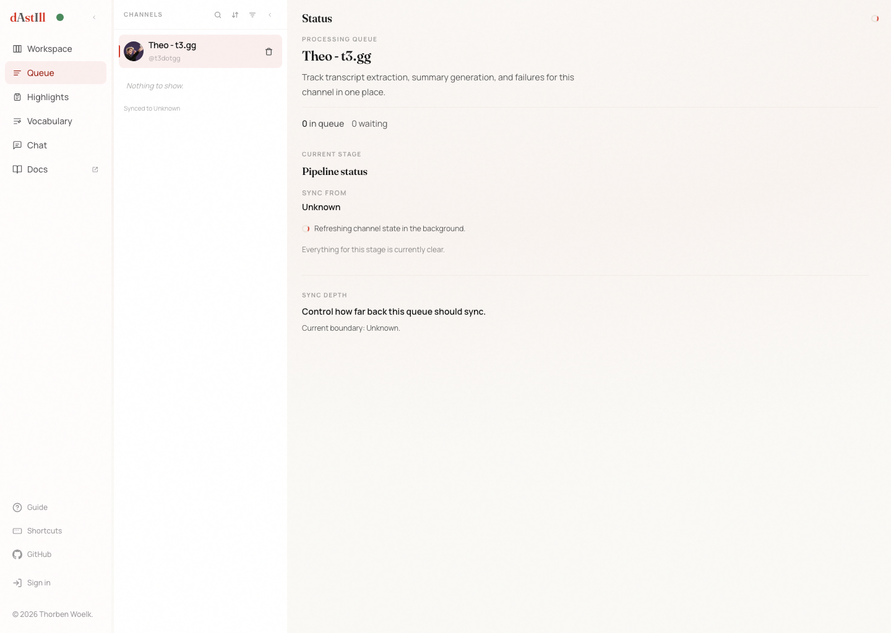
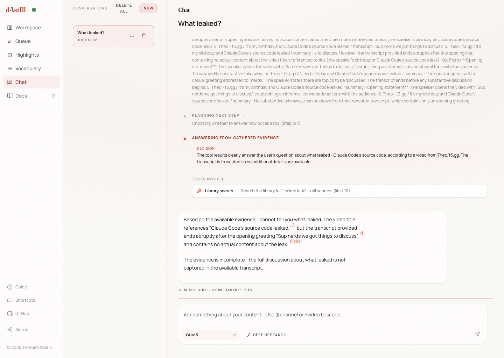

# UI Tour

  
Screenshots

  

    dAstIll follows a simple flow: check sources, open an item, read the summary or transcript-like
    text, then use queue or chat when you need more detail.
  

  

    <strong>Core routes:</strong> Workspace, Channel overview, Queue, Highlights, Vocabulary, Chat, Docs.
  

  

    
Capture date

    
April 1, 2026. The screenshots below reflect that build and may lag small copy or layout updates described on this page.

  

  

    
Primary loop

    
Browse, read, check processing status, ask questions. The routes are separate, but they use the same content and layout structure.

  

  

    
Signed-out experience

    
Anonymous browsing and quota-limited chat remain available even before sign-in.

  

  

    
Guide entry point

    
The Guide button in the left navigation rail opens the built-in walkthrough from the workspace.

  

## Surface Map

  <article class="tour-surface-row">
    
Workspace

    
<strong>Main view.</strong> Browse sources, scan synced items, and switch the selected item between info, summary, highlights, and transcript-like text.

  </article>
  <article class="tour-surface-row">
    
Queue

    
<strong>Processing status.</strong> See transcript extraction, summary generation, failures, and backfill depth without leaving the main layout.

  </article>
  <article class="tour-surface-row">
    
Channel overview

    
<strong>Source-level view.</strong> Open a dedicated channel route to inspect one source, manage sync depth, and review that channel without the full reader layout.

  </article>
  <article class="tour-surface-row">
    
Chat

    
<strong>Library chat.</strong> Ask questions across the same library, switch models per conversation, and turn on deep research for broader synthesis.

  </article>
  <article class="tour-surface-row">
    
Saved items

    
<strong>Highlights and vocabulary.</strong> Save useful excerpts and define replacement rules for future summaries.

  </article>

## Workspace

The workspace is the main screen. On desktop, navigation is on the left, source and item browsing is in the middle, and the selected content is on the right. You can move from browsing to reading without losing your place.

<figure class="tour-figure tour-figure--wide">
  
  <figcaption>
    Desktop workspace. The selected video stays in focus while the main pane swaps between info, summary, highlights, and transcript.
  </figcaption>
</figure>

- The left navigation lets you change routes without losing the current reading view.
- The middle column lists recent items first.
- The content pane focuses on reading, with info, summary, highlights, and transcript available as main views.
- Ready summaries can also expose generated summary-audio playback when TTS is enabled on the backend.
- Signed-out visitors still get a usable workspace through the default seeded source.

## Queue

The queue is not another library page. It shows content that is still moving through the pipeline. When work is pending, this route shows incomplete transcripts, missing summaries, retries, and sync boundaries. When the system is caught up, the page shows a clear state instead of disappearing.

<figure class="tour-figure tour-figure--wide">
  
  <figcaption>
    Queue route in a clear state on April 1, 2026. The layout stays useful even when no items are currently waiting.
  </figcaption>
</figure>

- Queue state is still compatibility-scoped around one selected source at a time.
- Sync depth lives here because backfill policy is an operational control, not a reading preference.
- This route uses the same main layout as the workspace, so switching between them is simple.

## Chat

Chat uses the same transcripts and summaries, but the workflow is different. Instead of opening one video and reading it, you ask questions across the library. Model choice and deep-research mode stay in the conversation flow instead of being hidden in settings.

<figure class="tour-figure tour-figure--wide">
  
  <figcaption>
    Chat during a live anonymous prompt. The UI streams tool progress, shows invoked search work, and then renders a grounded answer in the same thread.
  </figcaption>
</figure>

- Conversations have their own sidebar, rename flow, and delete controls.
- Anonymous usage is allowed, but it is quota-limited and conversation history is temporary.
- Tool progress is visible instead of hidden, so you can see what the assistant is doing.

## Mobile

On mobile, the layout puts reading first. The tab strip stays at the top of the content, while bottom navigation handles route changes. The result is a smaller layout that still keeps the main modes available.

<figure class="tour-figure tour-figure--mobile">
  
  <figcaption>
    Mobile workspace summary view. Reading remains primary, while section switches move to the bottom navigation bar.
  </figcaption>
</figure>

- The mobile layout prioritizes the selected video's content over the surrounding UI.
- The same content modes remain available through a compact top tab strip.
- Navigation, queue, highlights, and chat stay reachable without needing a separate mobile-only navigation model.

## Additional Surfaces

Not every route needs a full screenshot to understand its role:

- `Channel overview` at `/channels/[id]` is the source-focused management view used when you want to inspect one channel without opening a selected video in the main reader.
- `Highlights` is the saved excerpt library built from transcript or summary selections.
- `Vocabulary` stores replacement rules for future summaries.
- `Login` supports guest browsing, standard web Google sign-in, and the Android system-browser auth handoff used by the Tauri shell.
- `Docs` is a separate VitePress frontend linked from the product header.
- `Guide` reopens the in-product walkthrough overlay from inside the workspace.

## Why This UI Shape Matters

The UI is built around content state, not just navigation. Transcript readiness, summary readiness, evaluation status, search coverage, and acknowledgement state all appear directly in the reading and queue flows. The backend sends the frontend enough state to keep those views current while the pipeline is still running.
